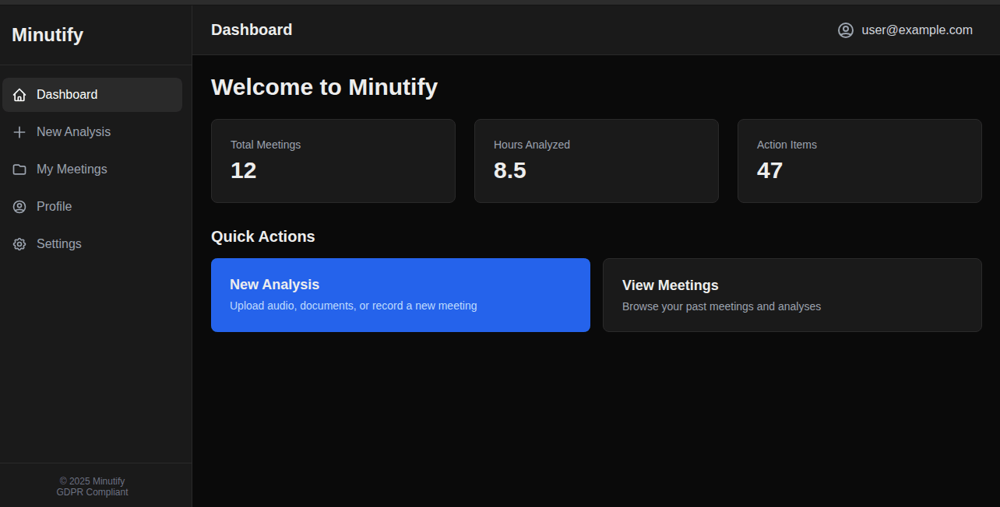
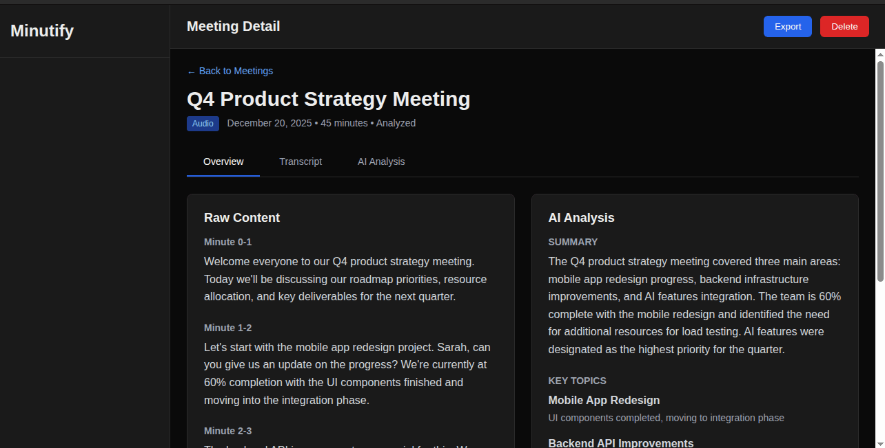
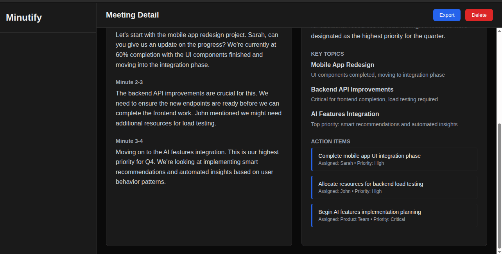
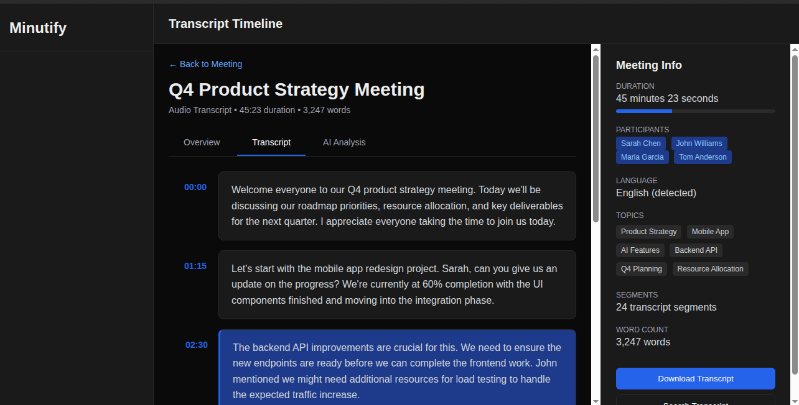
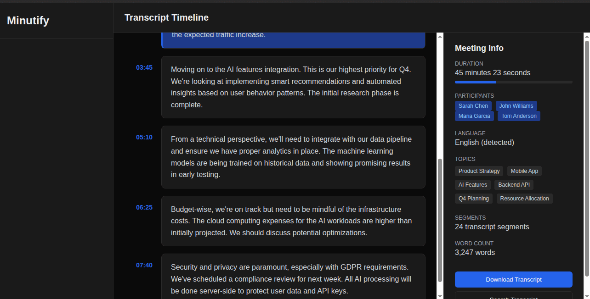
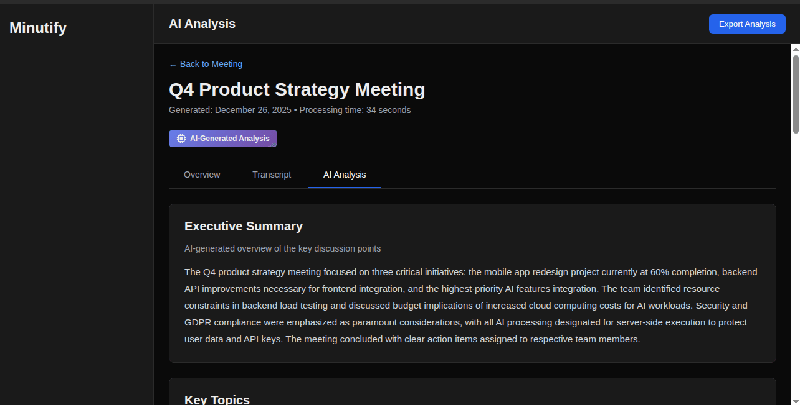
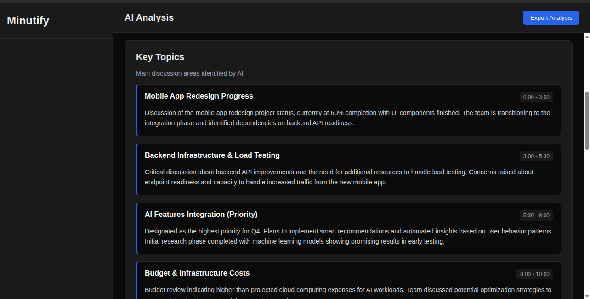
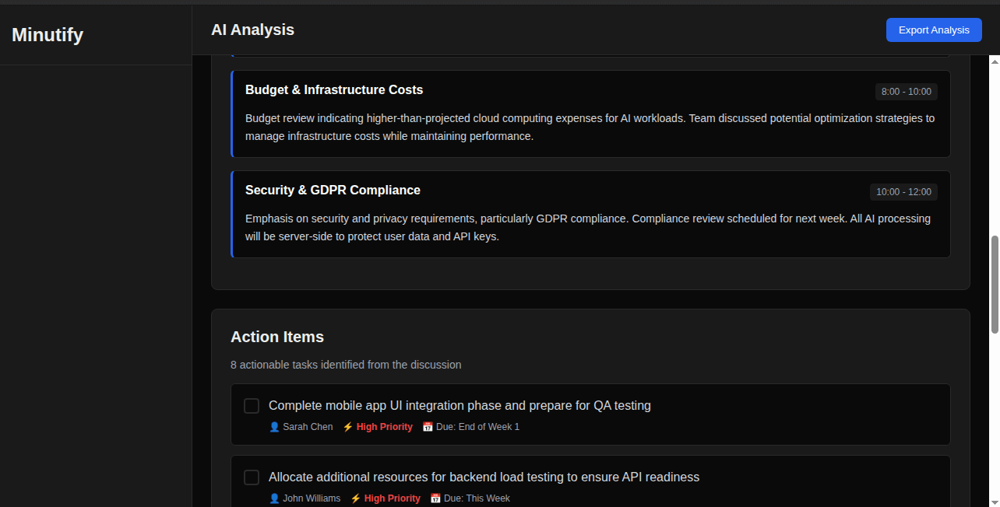
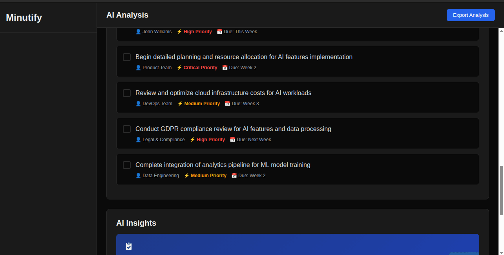
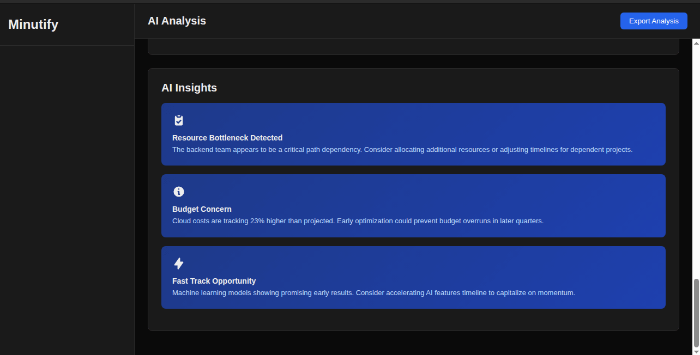

# Minutify

**AI-Powered Meeting and Document Analysis Platform**

**Author**: Satya Nagara  
**GitHub**: [@satyamagic](https://github.com/satyamagic)

Minutify is a modern web application designed to transcribe meetings, analyze documents, and generate structured insights using AI. Built with enterprise-grade security and GDPR compliance in mind, it serves as a portfolio project demonstrating full-stack development capabilities for EU and German companies.

---

## Table of Contents

- [Features](#features)
- [Screenshots](#screenshots)
- [Architecture](#architecture)
- [Tech Stack](#tech-stack)
- [Data Flow](#data-flow)
- [Privacy & GDPR Compliance](#privacy--gdpr-compliance)
- [Setup & Installation](#setup--installation)
- [Environment Variables](#environment-variables)
- [Project Structure](#project-structure)
- [Usage](#usage)
- [Limitations & Trade-offs](#limitations--trade-offs)
- [Future Improvements](#future-improvements)
- [License](#license)

---

## Features

### Input Methods
- **Audio Recording**: Record meetings directly in-browser using Web Audio API
- **Audio Upload**: Support for MP3, WAV, M4A, WebM, and OGG files (up to 100MB)
- **PDF Upload**: Extract and analyze PDF documents (up to 50MB)
- **DOCX Upload**: Process Microsoft Word documents (up to 50MB)
- **Google Docs Import**: Fetch publicly accessible Google Docs via URL

### Processing & Analysis
- **Transcription**: Minute-by-minute audio transcription using OpenAI Whisper
- **Document Parsing**: Intelligent section detection for structured documents
- **AI Analysis**: Generate summaries, topic segmentation, and action items using OpenAI GPT
- **Timestamp Generation**: Navigate audio transcripts by minute markers

### User Management
- **Secure Authentication**: Email/password and Google Sign-In via Firebase Auth
- **Protected Routes**: All dashboard pages require authentication
- **User-Scoped Data**: Complete data isolation between users

### GDPR Compliance
- **Data Export**: Export all meeting data as Markdown files
- **Right to Deletion**: Delete individual meetings or all user data
- **Explicit Consent**: GDPR consent checkbox during registration
- **EU Data Residency**: Firebase configured for European data centers

### UI/UX
- **Dark Mode**: Professional dark theme optimized for extended use
- **Responsive Design**: Works on desktop, tablet, and mobile devices
- **Dashboard Layout**: Clean sidebar navigation with header
- **Progress Indicators**: Real-time upload and processing status

---

## Screenshots

### Dashboard


### Detail View



### Transcript View



### AI Analysis Panel






---

## Architecture

Minutify follows a modern full-stack architecture with clear separation of concerns:

```
┌─────────────────┐
│   Next.js App   │
│   (Frontend)    │
│                 │
│  - TypeScript   │
│  - Tailwind CSS │
│  - React Client │
└────────┬────────┘
         │
         │ API Calls
         │
┌────────▼────────┐      ┌──────────────────┐
│  Next.js API    │      │  Python Service  │
│  Route Handlers │◄────►│                  │
│                 │      │  - Whisper       │
│  - Auth Check   │      │  - PDF Parser    │
│  - Data Queries │      │  - DOCX Parser   │
│  - AI Analysis  │      │  - Google Docs   │
└────────┬────────┘      └──────────────────┘
         │
         │ Firebase SDK
         │
┌────────▼────────┐
│    Firebase     │
│                 │
│  - Auth         │
│  - Firestore    │
│  - Storage      │
└─────────────────┘
```

### Key Components

1. **Frontend (Next.js App Router)**
   - Server-side rendering for initial page loads
   - Client-side routing for navigation
   - React components with TypeScript

2. **Backend (Next.js API Routes)**
   - Server-side Firebase Admin SDK for secure operations
   - OpenAI API integration (server-side only)
   - Authentication middleware

3. **Processing Service (Python FastAPI)**
   - Independent microservice for heavy processing
   - Whisper model for audio transcription
   - Document parsing libraries

4. **Database & Storage (Firebase)**
   - Firestore for structured data
   - Firebase Storage for files
   - Firebase Auth for user management

---

## Tech Stack

### Frontend
- **Framework**: Next.js 15 (App Router)
- **Language**: TypeScript (strict mode)
- **Styling**: Tailwind CSS
- **Icons**: Heroicons
- **State Management**: React Context API

### Backend
- **API**: Next.js Route Handlers & Server Actions
- **Authentication**: Firebase Authentication
- **Database**: Firebase Firestore
- **File Storage**: Firebase Storage
- **AI**: OpenAI API (GPT-4 / GPT-3.5)

### Processing Service
- **Framework**: FastAPI (Python)
- **Transcription**: OpenAI Whisper
- **PDF Parsing**: pdfplumber, PyPDF2
- **DOCX Parsing**: python-docx
- **Deployment**: Docker container

### Development Tools
- **Linting**: ESLint
- **Formatting**: Prettier
- **Version Control**: Git
- **Package Manager**: npm

---

## Data Flow

### 1. File Upload
```
User → Browser → Firebase Storage → Meeting Record Created
```

### 2. Processing
```
Meeting Record → Python Service → Whisper/Parser → Unified JSON Format
```

### 3. AI Analysis
```
Raw Content → Next.js API → OpenAI API → Analysis Record Saved
```

### 4. Viewing
```
User → Dashboard → Meeting Detail → Display Raw + AI Analysis Side-by-Side
```

### 5. GDPR Operations
```
User Request → Delete Function → Firestore + Storage Cleanup → Confirmation
```

---

## Privacy & GDPR Compliance

Minutify is built with privacy and GDPR compliance as core principles:

### Data Protection Measures

1. **User Consent**: Explicit GDPR consent required during registration
2. **Data Minimization**: Only essential data is collected
3. **Purpose Limitation**: Data used only for stated analysis purposes
4. **Storage Limitation**: Users can delete data at any time
5. **Data Portability**: Full data export in Markdown format
6. **Security**: Firebase security rules enforce user-level access control

### Technical Implementation

- **Firestore Security Rules**: All queries scoped to authenticated user
- **Storage Security Rules**: Files accessible only by owning user
- **No Client-Side AI**: API keys never exposed to browser
- **No Third-Party Tracking**: No analytics or advertising SDKs
- **EU Data Centers**: Firebase configured for European region

### User Rights

Users can exercise their GDPR rights through the application:

- **Right to Access**: View all stored meetings and analyses
- **Right to Rectification**: Edit meeting titles and metadata
- **Right to Erasure**: Delete individual meetings or all data
- **Right to Data Portability**: Export data as Markdown
- **Right to Object**: Stop processing by deleting account

### Data Retention

- User data retained indefinitely unless user requests deletion
- Deleted data is permanently removed from database and storage
- No backups retained after deletion (Firebase permanent delete)

---

## Setup & Installation

### Prerequisites

- Node.js 18+ and npm
- Python 3.9+ (for processing service)
- Firebase account
- OpenAI API account

### 1. Clone Repository

```bash
git clone <repository-url>
cd minutify-ai
```

### 2. Install Node Dependencies

```bash
npm install
```

### 3. Configure Firebase

Follow the detailed guide in [FIREBASE_SETUP.md](./FIREBASE_SETUP.md):

1. Create Firebase project
2. Enable Authentication (Email/Password, Google)
3. Create Firestore database
4. Set up Storage
5. Deploy security rules
6. Get configuration credentials

### 4. Configure Environment Variables

Copy `.env.example` to `.env.local`:

```bash
cp .env.example .env.local
```

Fill in all required values (see [Environment Variables](#environment-variables) section below).

### 5. Set Up Python Processing Service

```bash
cd python-service
python3 -m venv venv
source venv/bin/activate  # Windows: venv\Scripts\activate
pip install -r requirements.txt
```

**Note**: First install downloads Whisper model (~2GB). Install ffmpeg:

```bash
# Ubuntu/Debian
sudo apt-get install ffmpeg

# macOS
brew install ffmpeg
```

### 6. Start Development Servers

**Terminal 1 - Next.js**:
```bash
npm run dev
```

**Terminal 2 - Python Service**:
```bash
cd python-service
source venv/bin/activate
python main.py
```

### 7. Access Application

- Frontend: http://localhost:3000
- Python Service: http://localhost:8000
- API Docs: http://localhost:8000/docs

---

## Environment Variables

Minutify requires the following environment variables in `.env.local`:

### Firebase Client (Public)
```env
NEXT_PUBLIC_FIREBASE_API_KEY=          # From Firebase Console
NEXT_PUBLIC_FIREBASE_AUTH_DOMAIN=      # your-project.firebaseapp.com
NEXT_PUBLIC_FIREBASE_PROJECT_ID=       # your-project-id
NEXT_PUBLIC_FIREBASE_STORAGE_BUCKET=   # your-project.appspot.com
NEXT_PUBLIC_FIREBASE_MESSAGING_SENDER_ID= # Sender ID
NEXT_PUBLIC_FIREBASE_APP_ID=           # App ID
```

### Firebase Admin (Server-Side Only - NEVER COMMIT)
```env
FIREBASE_PROJECT_ID=                    # Same as public project ID
FIREBASE_CLIENT_EMAIL=                  # Service account email
FIREBASE_PRIVATE_KEY=                   # Service account private key (keep quotes)
```

### OpenAI API (Server-Side Only - NEVER COMMIT)
```env
OPENAI_API_KEY=                         # sk-proj-...
```

### Python Service
```env
PYTHON_SERVICE_URL=http://localhost:8000  # URL to Python service
```

### Google Docs (Optional)
```env
GOOGLE_DOCS_API_KEY=                    # For enhanced Google Docs access
```

### Application
```env
NEXT_PUBLIC_APP_URL=http://localhost:3000  # Application URL
```

**Security Notes**:
- Never commit `.env.local` to version control
- Keep `FIREBASE_PRIVATE_KEY` and `OPENAI_API_KEY` secret
- Use different credentials for development and production
- Rotate keys regularly

---

## Project Structure

```
minutify-ai/
├── app/                          # Next.js App Router
│   ├── (auth)/                   # Authentication pages
│   │   ├── login/
│   │   ├── register/
│   │   └── layout.tsx
│   ├── (dashboard)/              # Protected dashboard pages
│   │   └── dashboard/
│   │       ├── page.tsx          # Main dashboard
│   │       ├── new/              # New analysis
│   │       ├── meetings/         # Meetings list
│   │       ├── profile/          # User profile + GDPR
│   │       └── settings/
│   ├── api/                      # API routes (future)
│   ├── layout.tsx                # Root layout
│   ├── page.tsx                  # Landing page
│   └── globals.css               # Global styles
│
├── components/                   # React components
│   ├── input/
│   │   ├── AudioRecorder.tsx     # Browser audio recording
│   │   └── FileUpload.tsx        # Drag-and-drop upload
│   └── layout/
│       ├── Header.tsx            # Top header with user menu
│       └── Sidebar.tsx           # Navigation sidebar
│
├── lib/                          # Utilities and helpers
│   ├── contexts/
│   │   └── AuthContext.tsx       # Authentication context
│   ├── db/
│   │   ├── meetings.ts           # Meeting CRUD operations
│   │   └── analysis.ts           # Analysis operations
│   ├── firebase/
│   │   ├── client.ts             # Firebase client SDK
│   │   ├── admin.ts              # Firebase admin SDK
│   │   ├── firestore.rules       # Firestore security rules
│   │   └── storage.rules         # Storage security rules
│   ├── gdpr/
│   │   └── delete.ts             # GDPR deletion functions
│   ├── storage/
│   │   └── upload.ts             # File upload helpers
│   └── types.ts                  # TypeScript type definitions
│
├── python-service/               # Python processing microservice
│   ├── main.py                   # FastAPI application
│   ├── transcription.py          # Whisper transcription
│   ├── document_parser.py        # PDF/DOCX parsing
│   ├── google_docs.py            # Google Docs fetching
│   ├── requirements.txt          # Python dependencies
│   ├── Dockerfile                # Docker configuration
│   └── README.md                 # Service documentation
│
├── screenshots/                  # Application screenshots
│
├── .env.example                  # Environment variables template
├── .gitignore                    # Git ignore rules
├── .eslintrc.json                # ESLint configuration
├── .prettierrc                   # Prettier configuration
├── next.config.ts                # Next.js configuration
├── tailwind.config.ts            # Tailwind configuration
├── tsconfig.json                 # TypeScript configuration
├── package.json                  # Node dependencies
├── PROJECT_PLAN.md               # Development plan
├── FIREBASE_SETUP.md             # Firebase setup guide
└── README.md                     # This file
```

---

## Usage

### 1. Register Account

1. Navigate to http://localhost:3000
2. Click "Register"
3. Enter email and password
4. Accept GDPR consent
5. Submit registration

### 2. Create New Analysis

1. Log in to dashboard
2. Click "New Analysis"
3. Choose input method:
   - Record audio directly
   - Upload audio file
   - Upload PDF document
   - Upload DOCX document
   - Import Google Docs URL

### 3. View Results

1. Processing happens automatically
2. Navigate to "My Meetings"
3. Click on a meeting to view:
   - Raw transcript/content
   - AI-generated summary
   - Topic segmentation
   - Action items

### 4. Export Data

1. Go to Profile
2. Click "Export All Data"
3. Receive Markdown export

### 5. Delete Data

1. Go to Profile
2. Click "Delete All Data"
3. Confirm deletion
4. All data permanently removed

---

## Limitations & Trade-offs

### Current Limitations

1. **Google Docs**: Only works with publicly accessible documents
2. **Transcription Speed**: Processing time is 1-2x audio duration
3. **File Size Limits**: 100MB audio, 50MB documents
4. **Single Language**: Whisper detects language but UI is English-only
5. **No Real-Time Collaboration**: Single-user focused
6. **Limited Audio Formats**: Best results with clear speech, minimal background noise

### Technical Trade-offs

1. **Client-Side Auth Check**: Route protection happens in layout, not true middleware
2. **Whisper Model Size**: Using "base" model for speed/accuracy balance
3. **Document Parsing**: Simple heuristics for section detection, not ML-based
4. **No Caching**: Every transcription/analysis runs fresh
5. **Synchronous Processing**: No job queue system

### Scalability Considerations

- Firestore and Storage scale automatically with Firebase
- Python service needs horizontal scaling for production
- Whisper transcription is CPU/GPU intensive
- Consider job queue (Bull, AWS SQS) for production

### Security Notes

- Firebase security rules provide basic protection
- Production should implement rate limiting
- Consider adding CAPTCHA for registration
- API keys should use environment-specific credentials
- Implement request validation and sanitization

---

## Future Improvements

### Short Term
- [ ] Real-time transcription progress updates
- [ ] Speaker diarization (identify different speakers)
- [ ] Multi-language UI support
- [ ] Meeting search and filtering
- [ ] Tags and categories for meetings
- [ ] Meeting sharing (read-only links)

### Medium Term
- [ ] Background job processing with queue
- [ ] Email notifications for completed processing
- [ ] Advanced document parsing with ML
- [ ] Custom AI prompt templates
- [ ] Meeting templates and presets
- [ ] Audio/video playback with synchronized transcript

### Long Term
- [ ] Real-time collaborative editing
- [ ] Integration with calendar systems (Google Calendar, Outlook)
- [ ] Automatic meeting scheduling and recording
- [ ] Mobile applications (iOS, Android)
- [ ] API for third-party integrations
- [ ] Self-hosted option with Docker Compose
- [ ] Multi-tenant organization support

### Technical Improvements
- [ ] Server-side session management
- [ ] Redis caching layer
- [ ] CDN for static assets
- [ ] Automated testing (unit, integration, E2E)
- [ ] CI/CD pipeline
- [ ] Monitoring and logging (Sentry, DataDog)
- [ ] Performance optimization (code splitting, lazy loading)
- [ ] SEO optimization
- [ ] Accessibility audit and improvements (WCAG compliance)

---

## License

MIT License

Copyright (c) 2025 Satya Nagara

Permission is hereby granted, free of charge, to any person obtaining a copy
of this software and associated documentation files (the "Software"), to deal
in the Software without restriction, including without limitation the rights
to use, copy, modify, merge, publish, distribute, sublicense, and/or sell
copies of the Software, and to permit persons to whom the Software is
furnished to do so, subject to the following conditions:

The above copyright notice and this permission notice shall be included in all
copies or substantial portions of the Software.

THE SOFTWARE IS PROVIDED "AS IS", WITHOUT WARRANTY OF ANY KIND, EXPRESS OR
IMPLIED, INCLUDING BUT NOT LIMITED TO THE WARRANTIES OF MERCHANTABILITY,
FITNESS FOR A PARTICULAR PURPOSE AND NONINFRINGEMENT. IN NO EVENT SHALL THE
AUTHORS OR COPYRIGHT HOLDERS BE LIABLE FOR ANY CLAIM, DAMAGES OR OTHER
LIABILITY, WHETHER IN AN ACTION OF CONTRACT, TORT OR OTHERWISE, ARISING FROM,
OUT OF OR IN CONNECTION WITH THE SOFTWARE OR THE USE OR OTHER DEALINGS IN THE
SOFTWARE.

---

## Contact & Contributions

**Author**: Satya Nagara  
**GitHub**: https://github.com/satyamagic  
**Repository**: https://github.com/satyamagic/minutify-ai

This is a portfolio project demonstrating full-stack development capabilities for EU/German companies. It showcases:

- Modern web application architecture
- GDPR-compliant data handling
- Enterprise-grade security practices
- Clean, maintainable code
- Comprehensive documentation
- Production-ready patterns

For questions or feedback, please open an issue on the repository.

---

Satya Nagara